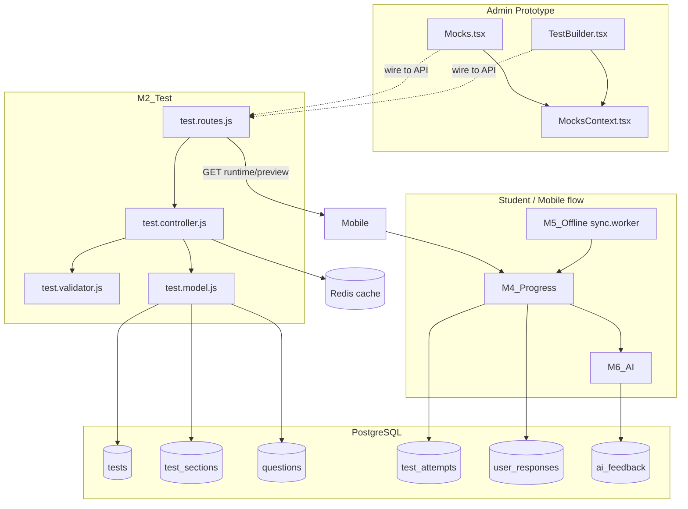
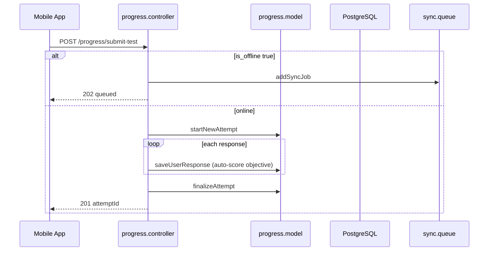
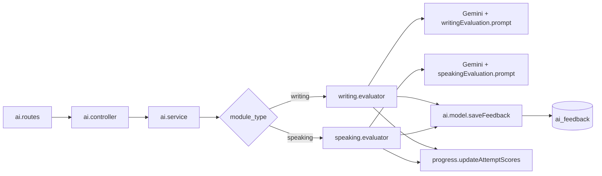

# Admin Mocks ↔ Backend Integration Reference

This document explains how the backend test/mock modules work, how data flows between layers, and how to wire **Admin-Prototype** (`Mocks.tsx`, `MocksContext.tsx`, `TestBuilder.tsx`) to the live API.

**Base URL:** `http://localhost:5000/api/v1` (see `Backend/index.js`)

| Module | Mount path | Role |
|--------|------------|------|
| M2_Test | `/content/test` | Create/edit/list mocks (admin + mobile) |
| M4_Progress | `/progress` | Submit attempts, scores, results |
| M6_AI | `/ai` | Writing/speaking AI evaluation |
| M5_Offline | (worker only) | Queue offline submissions |

All routes below require `Authorization: Bearer <token>` unless noted. Admin routes also require `role: admin`.

---

## 1. High-level architecture



**Content hierarchy (admin builds this):**

```
tests (1 row per mock)
  └── test_sections (Reading, Listening, Writing, Speaking, …)
        └── questions (MCQ, essays, speaking parts, …)
```

**Attempt hierarchy (student takes test):**

```
test_attempts (one per user per try)
  └── user_responses (one row per question answered)
        └── optional ai_feedback (writing/speaking via M6)
```

---

## 2. Database schema (relevant columns)

### `tests` (`tests.sql`)

| Column | Type | Notes |
|--------|------|--------|
| `id` | uuid | Primary key — use everywhere (not `display_id`) |
| `display_id` | varchar | Auto `mck001`, `mck002`, … (`allocDisplayId`) |
| `title` | varchar | |
| `exam_type` | enum | `IELTS`, `PTE` |
| `test_category` | enum | `full_mock`, `single_module` |
| `total_duration` | int | Minutes (global) |
| `difficulty_level` | enum | `easy`, `medium`, `hard` |
| `passing_score` | numeric | Default 6.5 |
| `min_required_band` | numeric | Default 6.0 |
| `is_published` | bool | Maps to UI `published` / `draft` |
| `is_premium` | bool | Subscription gating on mobile |
| `created_by` | uuid | Admin user id |

### `test_sections` (`test_sections.sql`)

| Column | Notes |
|--------|--------|
| `test_id` | FK → tests |
| `section_name` | Display label |
| `section_type` | enum: `reading`, `listening`, `writing`, `speaking` |
| `sub_type` | Optional (e.g. Task 1 / Part 2) |
| `time_limit_minutes` | Per-section timer |
| `order_number` | Sort order |
| `instructions` | Text |
| `question_types_allowed` | jsonb array |
| `task_count` | Default 1 |

### `questions` (`questions.sql`)

| Column | Notes |
|--------|--------|
| `section_id` | FK → test_sections |
| `question_type` | e.g. `mcq`, `fill_blank` (validator allows any string ≤50) |
| `sub_question_type` | Finer type (e.g. `tf_not_given`) |
| `passage_text` | Reading/listening passage |
| `question_text` | Required |
| `options` | jsonb array |
| `correct_answer` | jsonb (shape varies by type) |
| `content` | jsonb extra payload |
| `audio_url`, `image_url` | Cloudinary URLs |
| `order_number`, `marks`, `difficulty` | |
| `min_words`, `max_words` | Writing |
| `prep_time_seconds`, `record_time_seconds` | Speaking |
| `tags` | jsonb array |

### `test_attempts` (`test_attempts.sql`)

Stores scores after submission: `overall_band_score`, per-module scores, `status` (`in_progress`, `completed`, …), offline/sync fields.

### `user_responses` (`user_responses.sql`)

Per-question answers during an attempt; objective types get `is_correct` / `marks_obtained` in M4; AI fills `ai_feedback_per_question`.

---

## 3. M2_Test — request flow

### Layer responsibilities

| File | Responsibility |
|------|----------------|
| `test.routes.js` | HTTP paths, `authenticate`, `authorizeRoles('admin')`, `apiLimiter` / `writeLimiter` |
| `test.validator.js` | Joi schemas for create, nested upsert, header update, question CRUD |
| `test.controller.js` | Validation, business rules, transactions, Redis cache bust, Cloudinary |
| `test.model.js` | SQL only — no HTTP |

### Admin API endpoints (for Mocks + TestBuilder)

| Method | Path | Controller | Purpose |
|--------|------|------------|---------|
| GET | `/content/test/admin/mocks` | `fetchAdminMocksDashboard` | List mocks (paginated) |
| GET | `/content/test/all-tests` | same as above | Alias |
| GET | `/content/test/:id` | `getTestById` | Full nested test (**includes `correct_answer` for admin**) |
| GET | `/content/test/:id/preview` | `getTestPreview` | Lightweight preview (no questions body) |
| POST | `/content/test/create-full-test` | `createFullTest` | Create test + sections + questions (transaction) |
| PUT | `/content/test/:id/nested` | `upsertTestNested` | Update header + sync sections/questions (delete missing) |
| PUT | `/content/test/header/:id` | `updateTestHeaderByID` | Metadata only |
| PUT | `/content/test/questions` | `addQuestionToSection` | Single question add |
| PUT | `/content/test/questions/:id` | `updateTestQuestionByID` | Single question patch |
| DELETE | `/content/test/questions/:id` | `deleteQuestionFromSection` | Deletes question + Cloudinary audio |
| DELETE | `/content/test/:id` | `deleteTest` | Cascade delete test |
| POST | `/content/test/mocks/assets` | `uploadTestAsset` | Multipart `file` → Cloudinary URL |

**Query params (dashboard):** `page`, `limit`, `search`, `exam_type` (`All` | `IELTS` | `PTE`)

### Business rules (controller)

1. **PTE + single_module** → rejected (`PTE must use full_mock`).
2. **single_module** → exactly **one** section in payload.
3. **full_mock** → must include all four section types: `reading`, `listening`, `writing`, `speaking`.
4. **single_module** → only one mock per `(exam_type, section_type)` (409 conflict if duplicate).
5. **display_id** auto-generated on create (`mck001` pattern).

### Response shapes

#### Dashboard list — `GET /admin/mocks`

```json
{
  "success": true,
  "cached": false,
  "page": 1,
  "limit": 10,
  "count": 3,
  "data": [
    {
      "id": "uuid",
      "display_id": "mck001",
      "title": "IELTS Reading Mock #1",
      "exam_type": "IELTS",
      "test_category": "full_mock",
      "is_published": true,
      "created_at": "2026-02-10",
      "total_duration": 60,
      "difficulty_level": "medium",
      "min_required_band": 6.0,
      "is_premium": false,
      "question_count": 40
    }
  ]
}
```

**Maps to `ExtendedMock` (Mocks.tsx):**

| Backend | Admin UI (`ExtendedMock`) |
|---------|---------------------------|
| `id` | Internal id (replace string `MCK001`) |
| `display_id` | Show in UI as human id |
| `title` | `title` |
| `exam_type` | `testType` |
| `is_published` | `status`: `published` / `draft` |
| `difficulty_level` | `difficulty` — capitalize: `Medium` |
| `total_duration` | `duration` |
| `question_count` | `questionsCount` |
| `test_category` | Derive `mode`: `full_mock` → `full`, `single_module` → `single` |
| *(from detail fetch)* sections | `sections[]` module names |

#### Create — `POST /create-full-test`

**Request body** (validated by `createTestSchema`):

```json
{
  "title": "IELTS Academic Full Mock",
  "exam_type": "IELTS",
  "test_category": "full_mock",
  "difficulty_level": "medium",
  "passing_score": 6.5,
  "min_required_band": 6.0,
  "total_duration": 120,
  "is_premium": false,
  "is_published": false,
  "sections": [
    {
      "section_name": "Reading",
      "section_type": "reading",
      "sub_type": null,
      "time_limit_minutes": 60,
      "order_number": 1,
      "instructions": "Read carefully…",
      "question_types_allowed": ["mcq"],
      "task_count": 1,
      "questions": [
        {
          "question_type": "mcq",
          "sub_question_type": null,
          "passage_text": "Long passage…",
          "question_text": "What is the main idea?",
          "word_limit_instruction": null,
          "options": ["A", "B", "C", "D"],
          "correct_answer": "A",
          "content": {},
          "audio_url": null,
          "image_url": null,
          "order_number": 1,
          "marks": 1,
          "difficulty": "medium",
          "min_words": 0,
          "max_words": 0,
          "prep_time_seconds": 0,
          "record_time_seconds": 0,
          "tags": []
        }
      ]
    }
  ]
}
```

**Response (201):**

```json
{
  "success": true,
  "data": { "id": "uuid", "display_id": "mck003", "title": "…" }
}
```

#### Update nested — `PUT /:id/nested`

Same `sections` array shape; include existing `id` on sections/questions to update; omit ids on new rows. Sections/questions not in payload are **deleted**.

**Response (200):** `{ "success": true, "data": <full structured test with correct_answer> }`

#### Full test detail — `GET /:id` (admin)

```json
{
  "success": true,
  "data": {
    "id": "uuid",
    "display_id": "mck001",
    "title": "…",
    "exam_type": "IELTS",
    "test_category": "full_mock",
    "is_published": true,
    "total_duration": 120,
    "global_time_limit_minutes": 120,
    "difficulty_level": "medium",
    "passing_score": 6.5,
    "min_required_band": 6.0,
    "is_premium": false,
    "sections": [
      {
        "id": "section-uuid",
        "section_name": "Reading",
        "section_type": "reading",
        "sub_type": null,
        "time_limit_minutes": 60,
        "order_number": 1,
        "instructions": "…",
        "question_types_allowed": [],
        "task_count": 1,
        "questions": [
          {
            "id": "question-uuid",
            "question_type": "mcq",
            "sub_question_type": null,
            "passage_text": "…",
            "question_text": "…",
            "options": [],
            "correct_answer": {},
            "content": {},
            "audio_url": null,
            "image_url": null,
            "order_number": 1,
            "marks": 1,
            "difficulty": "medium",
            "min_words": 0,
            "max_words": 0,
            "prep_time_seconds": 0,
            "record_time_seconds": 0,
            "tags": []
          }
        ]
      }
    ]
  }
}
```

#### Preview — `GET /:id/preview`

Section summaries only (counts, `layout_summary`), no full question list — good for Mocks.tsx preview modal if you want a fast load; use `GET /:id` for full edit.

#### Asset upload — `POST /mocks/assets`

- **Body:** `multipart/form-data`, field name `file`
- **Response:** `{ "success": true, "data": { "url": "https://res.cloudinary.com/…", "public_id": "…" } }`
- Use `url` as `audio_url` or `image_url` on questions; section-level `audioFile` in TestBuilder should be copied onto listening questions or stored in `content`.

### Mobile / student endpoints (context only)

| Endpoint | Output |
|----------|--------|
| `GET /mobile/dashboard` | Published tests + last attempt + `cta: start\|retake` |
| `GET /:id/runtime` | Test without `correct_answer`; free users only get `reading` + `writing` sections |
| `GET /available` | Catalog filtered by subscription |

Admin integration does **not** use these for CRUD; useful when testing end-to-end.

### Caching (`redisCache.js` + controller)

| Key pattern | TTL | When busted |
|-------------|-----|-------------|
| `test:dash:{exam}:{page}:{limit}:{search}` | 45s | Any test write |
| `test:admin:{id}` | 60s | `bustTestCache(id)` |
| `test:preview:{id}` | 60s | same |
| `test:runtime:{id}:{subscription}` | 60s | same |
| `test:mobile:{userId}:…` | 30s | Progress submit / offline sync |

`bustTestCache` runs after create, nested upsert, header update, question CRUD, delete.

---

## 4. Admin UI ↔ Backend field mapping

### Current Admin state (local only)

`MocksContext.tsx` holds `ExtendedMock[]` seeded from `dummyData.ts`. **No API calls today.**

`TestBuilder` on publish/draft calls `buildMockRecord()` → `addMock` / `updateMock` in context only.

### `BuilderState` → `create-full-test` / `nested` payload

| `BuilderState` / `BuilderSection` / `BuilderQuestion` | Backend field |
|------------------------------------------------------|---------------|
| `title` | `title` |
| `testType` (`IELTS` \| `PTE`) | `exam_type` |
| `mode` `full` → `full_mock`, `single` → `single_module` | `test_category` |
| `difficulty` `Easy`/`Medium`/`Hard` | `difficulty_level` → **lowercase** |
| `duration` | `total_duration` |
| publish vs draft | `is_published`: `true` / `false` |
| — | `passing_score`, `min_required_band`, `is_premium` (defaults ok) |
| `sections[].moduleType` | `section_type` → **lowercase** (`Reading` → `reading`) |
| `sections[].moduleType` | `section_name` (same label ok) |
| `sections[].passage` | `passage_text` on **each question** or first question |
| `sections[].audioFile` | upload → `audio_url` on listening questions |
| `sections[].writingTask`, `minWordLimit`, `cueCard` | `sub_type`, `min_words` / `max_words`, `content` json |
| `sections[].questions[].type` | `question_type` + map to `sub_question_type` (see table below) |
| `questions[].text` | `question_text` |
| `questions[].options` | `options` |
| `questions[].answer` / `correctAnswer` | `correct_answer` |
| `questions[].wordLimit` | `max_words` |
| `questions[].prepTime` | `prep_time_seconds` |
| `questions[].recordingLimit` | `record_time_seconds` |
| Section order index + 1 | `order_number` |
| Question index + 1 | `order_number` |

### Question type mapping (TestBuilder → backend)

| UI type (`TestBuilder`) | `question_type` | `sub_question_type` (suggested) |
|-------------------------|-----------------|----------------------------------|
| MCQ | `mcq` | `mcq` |
| Multi-select | `multi_select` | `multi_select` |
| True/False/NG | `true_false` | `tf_not_given` |
| Yes/No/NG | `yes_no` | `yn_not_given` |
| Matching | `matching` | `matching` |
| Sentence Completion | `sentence_completion` | `sentence_completion` |
| Short Answer | `short_answer` | `short_answer` |
| Form Fill | `form_fill` | `form_fill` |
| Task 1 Essay / Task 2 Essay | `essay` | `task_1` / `task_2` |
| Part 1/2/3 Speaking | `speaking` | `part_1` / `part_2` / `part_3` |

Objective scoring in M4 uses normalized compare against `correct_answer` for types listed in `progress.model.js` → `scoreObjective`.

### PTE `Speaking & Writing` section

Backend has **no** combined section enum. Options when integrating:

1. Split into two sections (`speaking` + `writing`) on save; or  
2. Map to `writing` with `sub_type: "speaking_writing"` and store speaking items as questions (document in `content`).

IELTS full mock: four sections match backend exactly. PTE full mock in UI uses 3 modules — backend still requires four `section_type`s for `full_mock`; align product rules or use `test_category` + custom validation later.

### Gaps to fix in Admin before API wire-up

| Topic | Admin today | Backend |
|-------|-------------|---------|
| Test types | `IELTS`, `TOEFL`, `PTE` | Only `IELTS`, `PTE` |
| IDs | `MCK001`, timestamp ids | UUID + `display_id` |
| Storage | React state + dummy seed | PostgreSQL |
| Edit load | `builderState` or `reconstructFromMock` | `GET /:id` → map to `BuilderState` |
| Audio/images | Local file names | `POST /mocks/assets` then URL fields |
| Delete | Context filter | `DELETE /:id` |

---

## 5. M4_Progress — attempt & submit flow



### Endpoints

| Method | Path | Output |
|--------|------|--------|
| POST | `/progress/submit-test` | Creates attempt + all responses + finalizes scores |
| GET | `/progress/my-stats` | `user_progress_stats` aggregate |
| GET | `/progress/result/:attempt_id` | Full result + per-question review |

### Submit body (`submitFullTestSchema`)

```json
{
  "test_id": "uuid",
  "client_started_at": "2026-05-16T10:00:00Z",
  "client_completed_at": "2026-05-16T12:00:00Z",
  "is_offline": false,
  "overall_band_score": 7.0,
  "reading_score": 7.5,
  "listening_score": 6.5,
  "writing_score": 7.0,
  "speaking_score": 6.5,
  "feedback": "Evaluation pending.",
  "responses": [
    {
      "question_id": "uuid",
      "user_answer": "A",
      "audio_response_url": null,
      "time_spent_seconds": 45,
      "word_count": 0,
      "client_created_at": "2026-05-16T10:05:00Z"
    }
  ]
}
```

**`saveUserResponse`** auto-grades MCQ, multi-select, T/F, fill-blank, etc. Writing/speaking typically need M6 AI or client-supplied band scores on finalize.

### Result payload (`getTestResult`)

Includes `main_info`, `stats.accuracy`, `scores_breakdown`, `ai_analysis` (from `ai_feedback` join), and `review[]` per question.

**Admin mocks do not call M4** unless you add a “preview as student” or analytics feature.

---

## 6. M6_AI — evaluation flow



### Endpoints

| Method | Path | Body | Returns |
|--------|------|------|---------|
| POST | `/ai/evaluate/writing` | `attempt_id`, `question_text`, `student_response`, optional `test_type`, `module_type` | Saved `ai_feedback` row |
| POST | `/ai/evaluate/speaking` | `attempt_id`, `transcribedText`, `durationSeconds` | Same |
| POST | `/ai/response-feedback` | `attempt_id`, `question_id`, `text` | Updates `user_responses.ai_feedback_per_question` |

**Rate limit:** `aiLimiter` — 40 requests / hour per IP.

**Writing evaluator output** (stored + attempt updated):

- `ai_feedback`: band breakdown, `detailed_analysis`, `improvement_suggestions`
- `test_attempts`: `writing_score`, `overall_band_score`, `feedback`, `status: completed`

**Speaking evaluator:** maps fluency/pronunciation fields into same tables.

Prompts: `writingEvaluation.prompt.js` (strict JSON rubric), `speakingEvaluation.prompt.js` (short JSON schema).

---

## 7. M5_Offline — sync worker

Loaded at server boot: `import './src/modules/M5_Offline/sync.worker.js'`.

When `submit-test` has `is_offline: true`, controller returns **202** and enqueues job. Worker repeats: `startNewAttempt` → `saveUserResponse` × N → `finalizeAttempt` with `sync_status: synced`, then busts `test:mobile:{userId}:*` cache.

---

## 8. Shared utilities

### `bandScoreCalculator.js`

- `calculateIELTSBand(correct, totalQuestions)` — reading/listening raw → band table  
- `roundIELTSOverall(average)` — IELTS rounding rules  
- `calculatePTEScore(raw, max)` — PTE scale  

Used by client or future server aggregation; **not** imported in the files listed for M2 controller (scores often sent on submit).

### `rateLimiter.middleware.js`

| Limiter | Applied to |
|---------|------------|
| `apiLimiter` | All `test.routes` |
| `writeLimiter` | Test mutations, progress submit |
| `aiLimiter` | AI routes |

---

## 9. Recommended integration plan (Admin Prototype)

### Phase A — Read-only Mocks list

1. Replace `dummyMocks` seed with `GET /content/test/admin/mocks`.
2. Map rows → `ExtendedMock` (use `display_id` for display, `id` uuid for API).
3. Preview modal: `GET /content/test/:id/preview` or full `/:id` if you need questions.

### Phase B — TestBuilder create/update

1. Add API client (axios/fetch) with admin token from `AuthContext`.
2. **Create:** map `BuilderState` → `POST /create-full-test`.
3. **Edit:** load `GET /content/test/:id`, map → `BuilderState` (store uuid on sections/questions).
4. **Save:** `PUT /:id/nested` with ids on existing entities.
5. **Publish:** set `is_published: true` in payload (draft: `false`).
6. **Assets:** upload listening audio / chart images before save; set `audio_url` / `image_url`.

### Phase C — Delete

`DELETE /content/test/:id` from Mocks delete confirm (use uuid, not `display_id`).

### Suggested service module (frontend)

```
Admin-Prototype/src/app/services/mockTestApi.ts
  listMocks(params)
  getMock(id)
  createMock(payload)
  updateMockNested(id, payload)
  deleteMock(id)
  uploadAsset(file)
  mapBuilderToPayload(state, isPublished)
  mapDetailToBuilder(data)
```

### Auth header

```
Authorization: Bearer <access_token>
```

Admin role required for all write/list admin endpoints.

---

## 10. End-to-end flows (quick reference)

| User action | API chain | DB effect |
|-------------|-----------|-----------|
| Admin lists mocks | `GET admin/mocks` | Read `tests` + question count |
| Admin builds & publishes | `POST create-full-test` or `PUT nested` | Insert/update `tests`, `test_sections`, `questions` |
| Student starts test | (client) + later `POST submit-test` | `test_attempts` + `user_responses` |
| Objective answers | inside `saveUserResponse` | `is_correct`, `marks_obtained` |
| Writing AI grade | `POST ai/evaluate/writing` | `ai_feedback` + attempt scores |
| Speaking AI grade | `POST ai/evaluate/speaking` | same |
| View result | `GET progress/result/:id` | Join attempt, responses, ai_feedback |
| Offline submit | `POST submit-test` `is_offline: true` → worker | Same as online, async |

---

## 11. File index

| Path | Role |
|------|------|
| `database/tests.sql` | Mock header table |
| `database/test_sections.sql` | Sections per mock |
| `database/questions.sql` | Questions per section |
| `database/test_attempts.sql` | User attempts |
| `database/user_responses.sql` | Per-question answers |
| `M2_Test/models/test.model.js` | SQL + `getStructuredTest` |
| `M2_Test/controller/test.controller.js` | HTTP + cache + transactions |
| `M2_Test/routes/test.routes.js` | Route map |
| `M2_Test/validator/test.validator.js` | Joi |
| `M4_Progress/*` | Submit & results |
| `M6_AI/*` | Gemini evaluators |
| `M5_Offline/sync.worker.js` | Offline queue processor |
| `utils/redisCache.js` | Redis get/set/del |
| `utils/bandScoreCalculator.js` | Band math helpers |
| `middleware/rateLimiter.middleware.js` | Express rate limits |
| `Admin-Prototype/.../MocksContext.tsx` | Local state types + `buildMockRecord` |
| `Admin-Prototype/.../Mocks.tsx` | List UI (dummy today) |
| `Admin-Prototype/.../TestBuilder.tsx` | 4-step builder (local save today) |

---

*Generated for Testiva FYP — use this doc when wiring Admin Mocks to `http://localhost:3000/api/v1/content/test`.*
